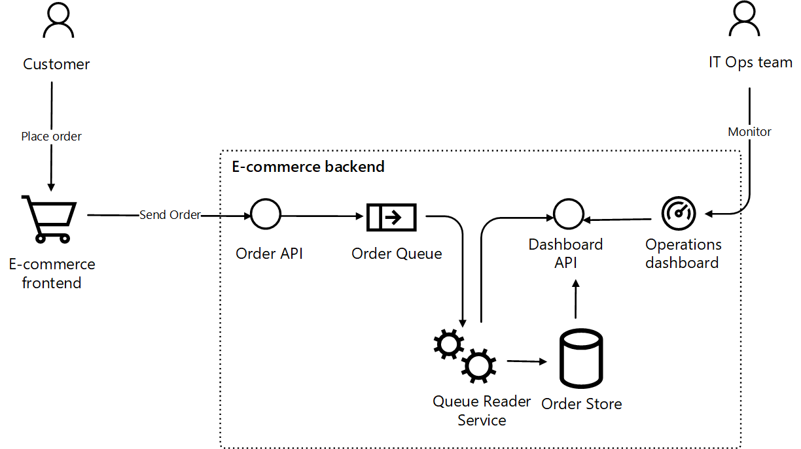

# Hands-on with Container Apps

The purpose of this repo is to help you quickly get hands-on with Container Apps. It is meant to be consumed either through GitHub codespaces or through a local Dev Container. The idea being that everything you need from tooling to runtimes is already included in the Dev Container so it should be as simple as executing a run command.

## Scenario

As a retailer, you want your customers to place online orders, while providing them the best online experience. This includes an API to receive orders that is able to scale out and in based on demand. You want to asynchronously store and process the orders using a queing mechanism that also needs to be auto-scaled. 
The following image illustrates the conceputal architecture

## Architecture
With a microservices architecture, Container Apps offer a simple experience that allows your developers focus on the services, and not infrastructure. The E-commerce backend will implemented as different Container Apps using built-in features for scaling, traffic splitting and service-to-service calls as illustrated in the following image

In this lab you will see how to:

1. Deploy the solution and configuration through IaaC, no need to understand Kubernetes
2. Ability to troubleshoot using built-in logging capability with Azure Monitor (Log Analytics)
3. Out of the box Telemetry with Dapr + Azure Monitor (Log Analytics)
4. Ability to split http traffic when deploying a new version
5. Ability to configure scaling to meet usage needs
6. Configure CI/CD deployment to private Azure Container Registry using GitHub Actions
7. Use API Management with Container Apps.
8. Enable Authentication for a Container App using Easy Auth.

Once this lab is completed you should have an Architecture that looks something like the diagram below.

## Pre-requisites

- A GitHub account
- An Azure Subscription
- License for using GitHub Codespaces (if you want use Codespaces as a development environment)

## Structure
The hackathon is divided into seven challenges. Each challenge consist of the following structure: 
- **Main objective(s)**
    
    Description of the objective(s) in this challenge. 
    
- **Activities**

    Description/guideline of which activities are necessary to complete the challenge.    

- **Definition of done**

    Description of what is necessary to define a challenge "done".

- **Helpful links**

    Some of the challenges has links with information that can be useful to complete the challenge. 

- **Solution**

    Each challenge has a step-by-step guide and also the final solution for the current solution. 

## The challenges

- [Challenge 1: Setup the environment](challenge1.md)
- [Challenge 2: Deploy Container Apps Environment and troubleshoot Container Apps](challenge2.md)
- [Challenge 3: Split traffic for controlled rollout](challenge3.md)
- [Challenge 4: Scale Container Apps](challenge4.md)
- [Challenge 5: Configure CI/CD for Container Apps](challenge5.md)
- [Challenge 6: Protect Container App with API Management](challenge6.md)
- [Challenge 7: Enable Container App authentication](challenge7.md)

## Contributors

Original creators
* Kevin Harris 
* Mahmoud El Zayet
* Mark Whitby 
* Anu Bhattacharya

Changes in this fork
* Jimmy Karlsson 
* Jonas Norlund 
* Peter Williams
* Arash Rassoulpour 
* Anders Heden 
* Kristofer Nissbrandt
