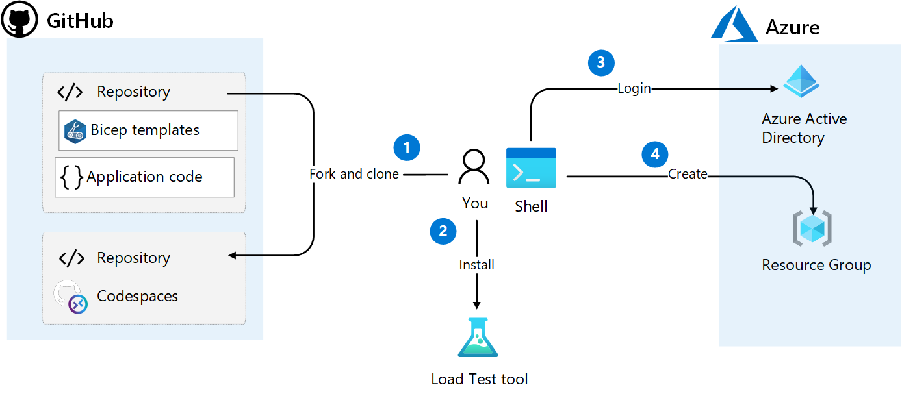

# Challenge 1: Setup the environment
You will work in a separate for of this repository in GitHub because in a later challenge you will trigger GitHub actions when code is merged to main and you don't have contributor permissions to this repository.

All Azure resources will be provisioned in one Resource Group that you create.

The following image illustrates the steps in this challenge

## Main objectives
- Determine and configure your development environment, shell and toolset to use. Some options are
  - GitHub Codespaces
  - Docker Desktop
  - Directly on local machines
  - PowerShell or Bash (or other shell of choice like ZSH, fish, _insert your favorite shell here_)
  - Azure PowerShell or AZ CLI (locally, in container or Azure Cloudshell)
  - Linux, Mac or Windows with Subsystem for Linux 
- Fork the repository and make a clone 
- Install load test tool
- Log in to Azure and create a resource group

## Activities
- Create a fork of this repository
- Clone the repository in a development environment
- Install the _hey_ load testing tool
- Install Azure CLI extension for Container Apps
- Log in to Azure
- Create a resource group with the naming convention "[seven letters]-rg" in an Azure region of choice 

## Definition of done
- Repository forked to your GitHub account
- Repository cloned
- _hey_ tool installed and verified
- A resource group created

## Helpful links
- [Azure PowerShell Documentation (learn.microsoft.com)](https://learn.microsoft.com/en-us/powershell/azure/?view=azps-8.3.0)
- [Azure Command-Line Interface (CLI) documentation (learn.microsoft.com)](https://learn.microsoft.com/en-us/cli/azure/)
- [Fork a repo (github.com)](https://docs.github.com/en/get-started/quickstart/fork-a-repo)
- [hey (github.com)](https://github.com/rakyll/hey)
- [az containerapp (learn.microsoft.com)](https://learn.microsoft.com/en-us/cli/azure/containerapp?view=azure-cli-latest)
- [New-AzResourceGroup (learn.microsoft.com)](https://learn.microsoft.com/en-us/powershell/module/az.resources/new-azresourcegroup?view=azps-8.3.0)
- [az group create (learn.microsoft.com)](https://learn.microsoft.com/en-us/cli/azure/group?view=azure-cli-latest#az-group-create)

## Solution
- View the solution here: [Challenge 1 - Solution](solution1.md)
## The challenges

- [Challenge 1: Setup the environment](challenge1.md)
- [Challenge 2: Deploy Container Apps Environment and troubleshoot Container Apps](challenge2.md)
- [Challenge 3: Split traffic for controlled rollout](challenge3.md)
- [Challenge 4: Scale Container Apps](challenge4.md)
- [Challenge 5: Configure CI/CD for Container Apps](challenge5.md)
- [Challenge 6: Protect Container App with API Management](challenge6.md)
- [Challenge 7: Enable Container App authentication](challenge7.md)

