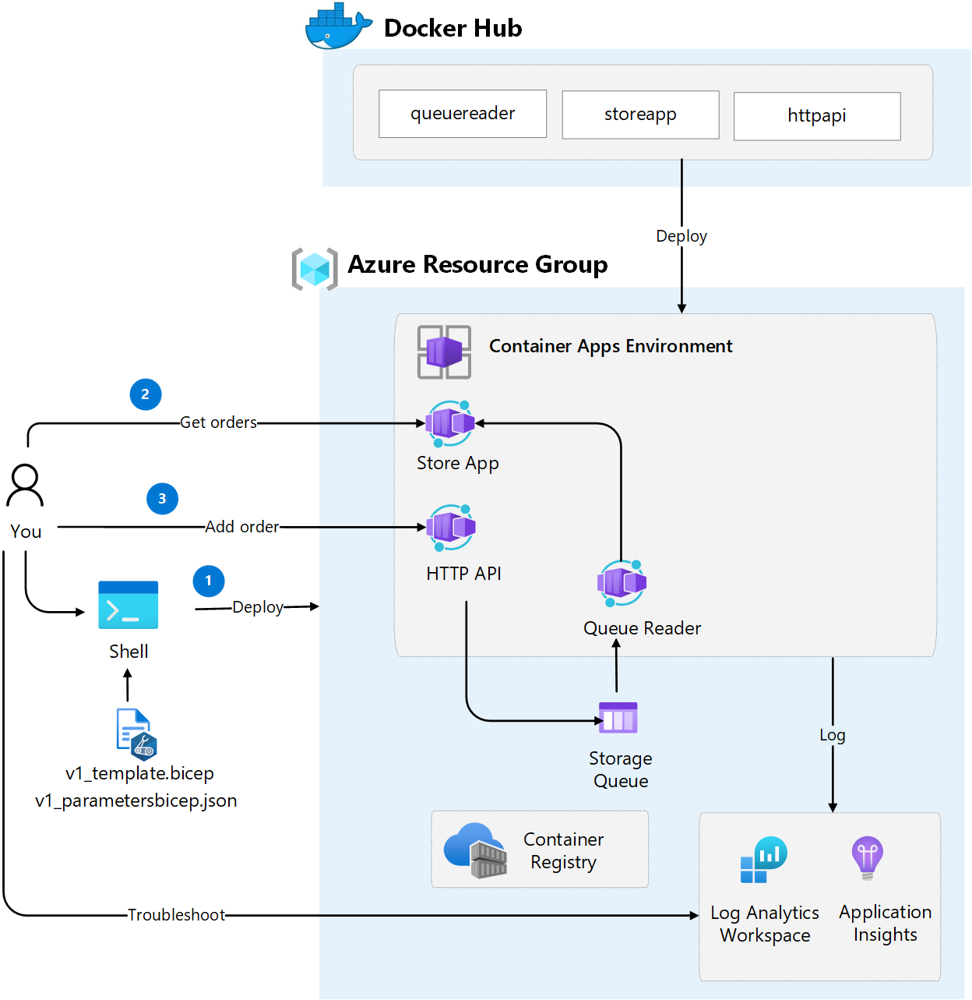

# Challenge 2: Deploy Container Apps Environment and troubleshoot Container Apps
You will deploy a container apps environment with related services such as Log Analytics and a Storage Account for the queue. At the end of this challenge you will verify that the application works and troubleshoot potential issues. 

The following image illustrates the steps in this challenge

## Main objectives
- Deploy a Container Apps environment with related resources
- Test APIs deployed as Container Apps
- Troubleshoot and find issues in the deployed Container Apps

## Activities

- Deploy Azure resources using an existing [Bicep template](v1_template.bicep)
- Call the StoreApp API go get existing orders
- Call the HttpApi to add a new order and verify it is being added
- Troubleshoot potential issues using Log Analytics and determine the reason. 
- Deploy a corrected version of the solution

## Definition of done
Verified that the following resources are deployed to the Azure resource group
  - Container Apps Environment
  - 3 Container Apps 
    - _storeapp_
    - _httpapi_
    - _queuereader_
- Application Insights
- Log Analytics
- Container Registry

Verified application functionality
- Make a _HTTP GET_ call to Store App API (https://storeapp.[your container app environment domain]/store) to fetch existing orders
- Add an order by doing a _HTTP POST_ to HttpAPI (https://httpapi.[your container app environment domain]/data?message=[your message])
- Do another call to Store App API to verify that order was added
- Potential issues detected and culprit located in the provided source code or templates.

Redeploy application
- Fix issue in source code or templates
- Deploy a new version of the solution

## Helpful links
- [az containerapp env show (learn.microsoft.com)](https://learn.microsoft.com/en-us/cli/azure/containerapp/env?view=azure-cli-latest#az-containerapp-env-show)
- [curl manual (curl.se)](https://curl.se/docs/manual.html)
- [Monitor logs in Azure Container Apps with Log Analytics (learn.microsoft.com)](https://learn.microsoft.com/en-us/azure/container-apps/log-monitoring?tabs=bash)

## Solution
- View the solution here: [Challenge 2 - Solution](solution2.md)

## The challenges

- [Challenge 1: Setup the environment](challenge1.md)
- [Challenge 2: Deploy Container Apps Environment and troubleshoot Container Apps](challenge2.md)
- [Challenge 3: Split traffic for controlled rollout](challenge3.md)
- [Challenge 4: Scale Container Apps](challenge4.md)
- [Challenge 5: Configure CI/CD for Container Apps](challenge5.md)
- [Challenge 6: Protect Container App with API Management](challenge6.md)
- [Challenge 7: Enable Container App authentication](challenge7.md)

