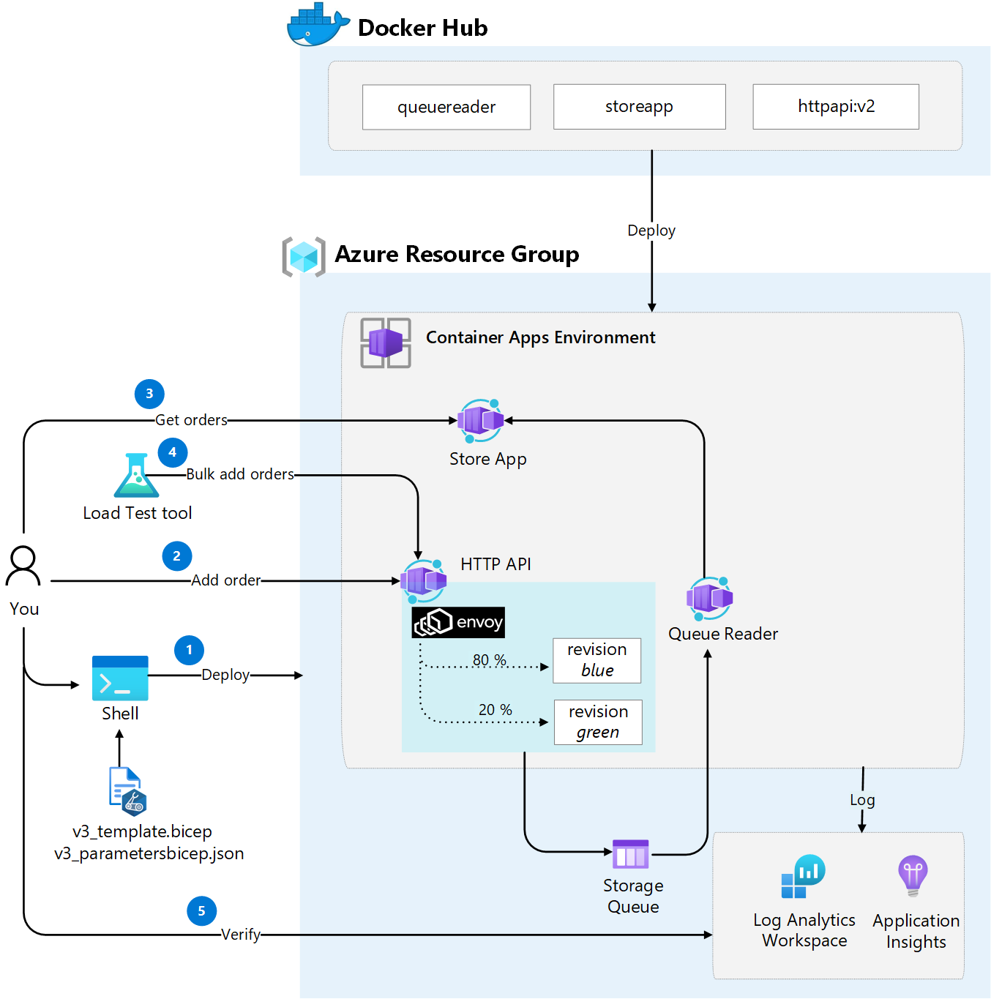

# Challenge 3: Split traffic for controlled rollout
Azure Container Apps implements container app versioning by creating revisions. More than one revision can be active at the same time with the possibility to split external HTTP traffic between the active revisions. This is useful in our scenario where we recently made updates to our Order _HTTP API_ code and we want to make sure this change is working as expected.

You will make needed changes to the configuration to support splitting traffic 80/20 between two revisions of the _HTTP API_.

The following image illustrates the steps in this challenge

## Main objectives
- Add support for traffic splitting
- Deploy new version of Container App
- Run load testing tool to examine splitting behavior

## Activities
- Add traffic split to the _HTTP API_ app by changing existing [Bicep template v3](v3_template.bicep)
- Deploy updated Bicep template
- Run _hay_ tool to bulk add orders via _HTTP API_
- Verify that traffic is distributed between _HTTP API_ Container App revisions 

## Definition of done
- Deployed traffic splitting with ratio 80/20 between blue and green revisions of _HTTP API_ Container App
- Bulk add 25 orders to _HTTP API_ (https://httpapi.[your container app environment domain]/data?message=[your message])
- Verify logs in Log Analytics for _Queue Reader_ application that approximately 20 % of the calls include your actual message and approximately 80 % still have the GUID message from the earlier revision.
 

## Helpful links
- [Revisions in Azure Container Apps (learn.microsoft.com)](https://learn.microsoft.com/en-us/azure/container-apps/revisions)
- [curl manual (curl.se)](https://curl.se/docs/manual.html)
- [Invoke-RestMethod (learn.microsoft.com)](https://learn.microsoft.com/en-us/powershell/module/microsoft.powershell.utility/invoke-restmethod?view=powershell-7.2)
- [Monitor logs in Azure Container Apps with Log Analytics (learn.microsoft.com)](https://learn.microsoft.com/en-us/azure/container-apps/log-monitoring?tabs=bash)

## Solution
- View the solution here: [Challenge 3 - Solution](solution3.md)

## The challenges

- [Challenge 1: Setup the environment](challenge1.md)
- [Challenge 2: Deploy Container Apps Environment and troubleshoot Container Apps](challenge2.md)
- [Challenge 3: Split traffic for controlled rollout](challenge3.md)
- [Challenge 4: Scale Container Apps](challenge4.md)
- [Challenge 5: Configure CI/CD for Container Apps](challenge5.md)
- [Challenge 6: Protect Container App with API Management](challenge6.md)
- [Challenge 7: Enable Container App authentication](challenge7.md)

