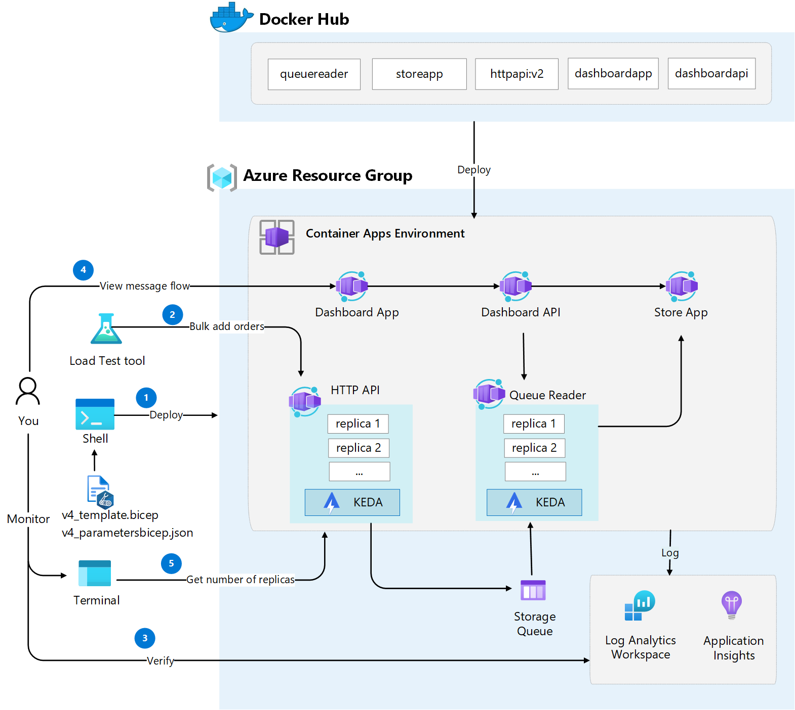

# Challenge 4: Scale Container Apps
Azure Container Apps manages automatic horizontal scaling through a set of declarative scaling rules. As a container app scales out, new instances of the container app are created on-demand. These instances are known as replicas.

In our scenario our app is about to go live so we will change things so that the new app is receiving all of the traffic, plus we'll also setup some scaling rules. This will allow the container apps to scale up when things are busy, and scale to zero when things are quiet. We will also deploy and additional _Dashboard App_ to monitor the orders currently in queue and store.

The following image illustrates the steps in this challenge

## Main objectives
- Add support for scaling Container App based on load
- Deploy new version of Container App
- Run load testing tool to examine scaling behavior

## Activities
- Examine scaling rules for _HTTP API_ and _Queue Reader_ app by reviewing existing [Bicep template v4](v4_template.bicep)
- Deploy the updated Bicep template
- Review _Queue Reader_ application logs in _Log Analytics_
- Run script to bulk add orders via _HTTP API_ and watch revisions
- View order count in store and queue using _Dashboard App_

## Definition of done
- Reviewed and understood scaling rules for _HTTP API_ and _Queue Reader_ Container Apps by examine existing [Bicep template v4](v4_template.bicep)
- Deployed [Bicep template v4](v4_template.bicep) including scaling rules
- Run [script](scripts\appwatch.sh) to bulk add 10000 orders via _HTTP API_ and watch replica scaling using _tmux_
- Verified logs in Log Analytics for _Queue Reader_ application that all orders are correctly using newest revision
- Examined order count in queue and store using Dashboard App (https://dashboardapp.[your container app environment domain])
 

## Helpful links
- [Set scaling rules in Azure Container Apps (learn.microsoft.com)](https://learn.microsoft.com/en-us/azure/container-apps/scale-app)
- [tmux (github.com)](https://github.com/tmux/tmux)
- [Monitor logs in Azure Container Apps with Log Analytics (learn.microsoft.com)](https://learn.microsoft.com/en-us/azure/container-apps/log-monitoring?tabs=bash)

## Solution
- View the solution here: [Challenge 4 - Solution](solution4.md)
## The challenges

- [Challenge 1: Setup the environment](challenge1.md)
- [Challenge 2: Deploy Container Apps Environment and troubleshoot Container Apps](challenge2.md)
- [Challenge 3: Split traffic for controlled rollout](challenge3.md)
- [Challenge 4: Scale Container Apps](challenge4.md)
- [Challenge 5: Configure CI/CD for Container Apps](challenge5.md)
- [Challenge 6: Protect Container App with API Management](challenge6.md)
- [Challenge 7: Enable Container App authentication](challenge7.md)

