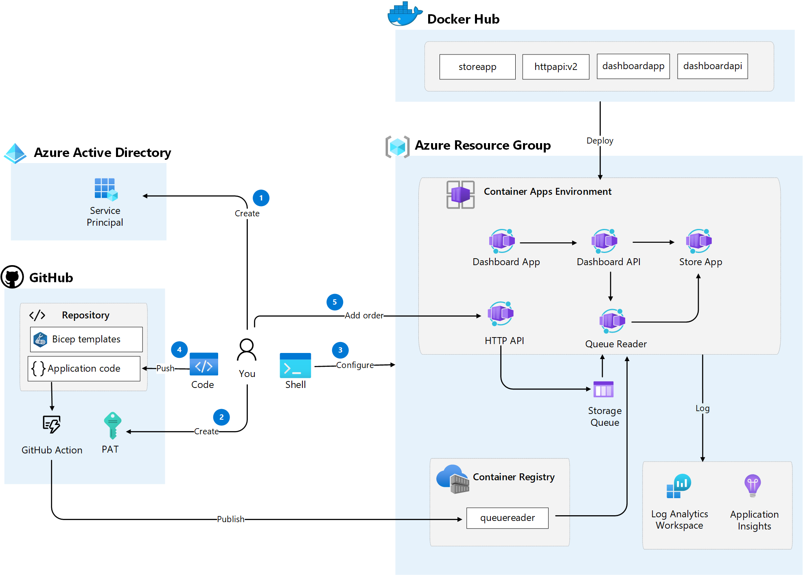

# Challenge 5: Configure CI/CD for Container Apps
Azure Container Apps allows you to use _GitHub Actions_ to publish revisions to your Container App. As commits are pushed to your GitHub repository, a GitHub Action is triggered which updates the container image in the container registry. Once the container is updated in the registry, Azure Container Apps creates a new revision based on the updated container image.

Until now we have worked with docker images that others have created, now we are going to do a code change on our own code base and push the changes to Container Apps using GitHub Actions. We are now going to use a Azure CLI command to create a GitHub Action that builds the _Queue Reader_ C# project and pushes the image to _Azure Container Registry_ and deploys it to our Container App.

The following image illustrates the steps in this challenge

## Main objectives
- Configure CI/CD deployment of a Container App using GitHub actions
- Make a code change and deploy new version of Container App
- Verify changes after deployment

## Activities
- Create an Azure AD service principal with contributor permissions on your resource group 
- Create a _Personal Access Token (PAT)_ in GitHub with permissions to your repository and GitHub actions
- Add a _GitHub Actions_ workflow to your repository to deploy a container app
- Do a code change in _Queue Reader_ app and push changes to GitHub repository
- Add a new order using _HTTP API_
- Verify that the code change has been deployed by looking in _Log Analytics_

## Definition of done
- Created an Azure AD service principal and assigned it _contributor_ access on your resource group 
- Created a _Personal Access Token (PAT)_ in GitHub with _repo_ and _workflows_ permissions
- Created a GitHub Actions workflow in your repository to deploy a container app
- Changed the C# code in _Queue Reader_ app to write a custom log message
- Pushed the changes to your GitHub repo
- Verified that the new version of your _Queue Reader_ app was successfully deployed
- Added an order by doing a _HTTP POST_ to _Http API_ (https://httpapi.[your container app environment domain]/data?message=[your message]) 
- Verified logs in _Log Analytics_ for _Queue Reader_ application that the new _Queue Reader_ Container App is logging with your custom log message

 

## Helpful links
- [Publish revisions with GitHub Actions in Azure Container Apps (learn.microsoft.com)](https://learn.microsoft.com/en-us/azure/container-apps/github-actions-cli?tabs=bash)
- [az containerapp github-action (learn.microsoft.com)](https://learn.microsoft.com/en-us/cli/azure/containerapp/github-action?view=azure-cli-latest)
- [Monitor logs in Azure Container Apps with Log Analytics (learn.microsoft.com)](https://learn.microsoft.com/en-us/azure/container-apps/log-monitoring?tabs=bash)

## Solution
- View the solution here: [Challenge 5 - Solution](solution5.md)

## The challenges

- [Challenge 1: Setup the environment](challenge1.md)
- [Challenge 2: Deploy Container Apps Environment and troubleshoot Container Apps](challenge2.md)
- [Challenge 3: Split traffic for controlled rollout](challenge3.md)
- [Challenge 4: Scale Container Apps](challenge4.md)
- [Challenge 5: Configure CI/CD for Container Apps](challenge5.md)
- [Challenge 6: Protect Container App with API Management](challenge6.md)
- [Challenge 7: Enable Container App authentication](challenge7.md)

