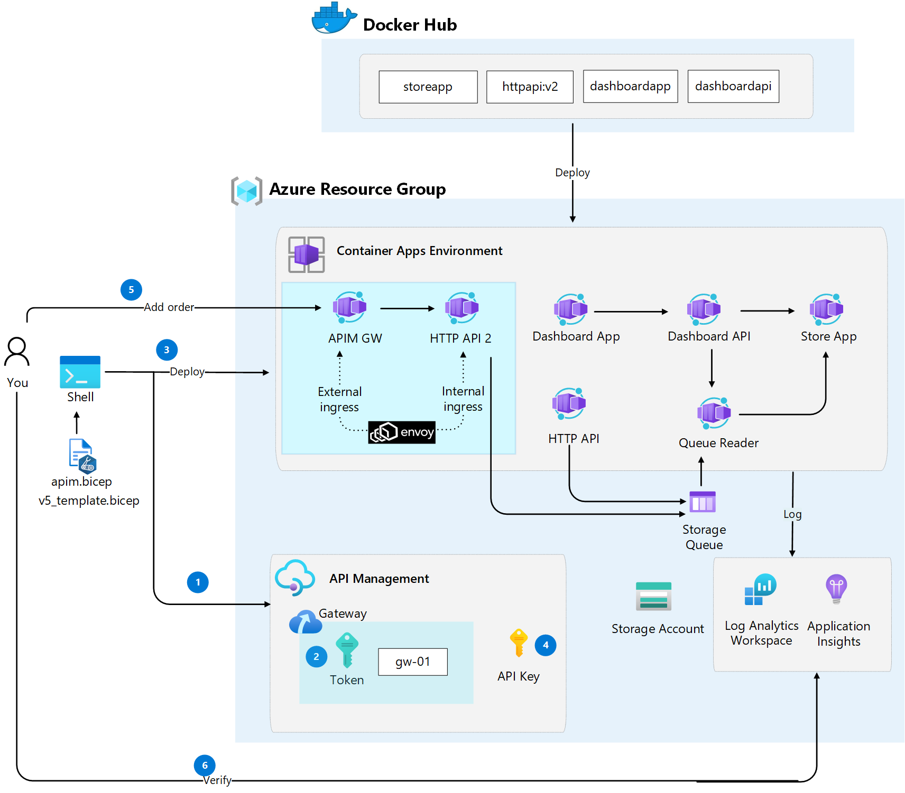

# Challenge 6: Protecting our HTTP API using API Management
The self-hosted gateway is an optional, containerized version of the default managed gateway included in every _API Management_ service. It's useful for scenarios such as placing gateways in the same environments where you host your APIs. Use the self-hosted gateway to improve API traffic flow and address API security and compliance requirements.

Now it's time to deploy our _HTTP API_ behind _API Management self hosted gateway (SHGW)_ to protect it from direct internet access.

> **Note** 
> The API Management creation in this challenge takes about 30-45 minutes to complete. Plan accordingly and perhaps start the deployment before a break.

The following image illustrates the steps in this challenge

## Main objectives
- Create an API Management service with self hosted gateway
- Deploy self hosted gateway as Container App
- Configure internal ingress for _HTTP API_
- Expose an internal _HTTP API_ operation via the self hosted gatway
- Verify changes after deployment

## Activities

- Create an _API Management_ service with self hosted gateway. Grab the _Gateway token_ from the provisioned SHGW
- Create a new Container App _HTTP API 2 (httpapi2)_ based on the same image used in previous challenge
- Configure an internal ingress for _httpapi2_ Container App 
- Create a new Container App _apim_ based on an image provided by Microsoft
- Configure an external ingress for _apim_ Container App
- Configure an API, operation in API Management and expose the API inside the SHGW

## Definition of done
- Created an _API Management_ service with self hosted gateway using existing [Bicep apim template](apim.bicep)
- Deployed [Bicep template v5](v5_template.bicep) which includes a new _HTTP API 2_ app
- Added a new order by doing a _HTTP POST_ to _HTTP API_ Container App (https://httpapi.[your container app environment domain]/data?message=[your message]) with a _APIM subscription key_ in the header (_X-API-key_) 
- Verified logs in _Log Analytics_ for _Queue Reader_ application that the _Queue Reader_ app is logging with your order message.
 

## Helpful links
- [API Management self-hosted gateway overview (learn.microsoft.com)](https://docs.microsoft.com/en-us/azure/api-management/self-hosted-gateway-overview)
- [curl manual (curl.se)](https://curl.se/docs/manual.html)
- [Invoke-RestMethod (learn.microsoft.com)](https://learn.microsoft.com/en-us/powershell/module/microsoft.powershell.utility/invoke-restmethod?view=powershell-7.2)
- [Monitor logs in Azure Container Apps with Log Analytics (learn.microsoft.com)](https://learn.microsoft.com/en-us/azure/container-apps/log-monitoring?tabs=bash)

## Solution
- View the solution here: [Challenge 6 - Solution](solution6.md)

## The challenges

- [Challenge 1: Setup the environment](challenge1.md)
- [Challenge 2: Deploy Container Apps Environment and troubleshoot Container Apps](challenge2.md)
- [Challenge 3: Split traffic for controlled rollout](challenge3.md)
- [Challenge 4: Scale Container Apps](challenge4.md)
- [Challenge 5: Configure CI/CD for Container Apps](challenge5.md)
- [Challenge 6: Protect Container App with API Management](challenge6.md)
- [Challenge 7: Enable Container App authentication](challenge7.md)

