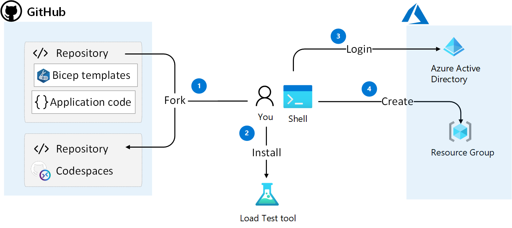

# Challenge 1: Setup the environment
You will work in a separate for of this repository in GitHub because in a later challenge you will trigger GitHub actions when code is merged to main and you don't have contributor permissions to this repository.

All Azure resources will be provisioned in one Resource Group that you create.

The following image illustrates the steps in this challenge

## Main objectives
- Fork the repository and clone the repository in the development environment of choice. Some options are
  - GitHub Codespaces
  - Docker Desktop
  - Directly on local machine
- Install load test tool
- Log in to Azure and create a resource group

## Activities

- Create a fork of this repository
- Clone the repository in a development environment
- Install the `hey` load testing tool
- Install Azure CLI extension for Container Apps
- Log in to Azure
- Create a resource group with the naming convention "[six letters]-rg" in an Azure region of choice 

## Definition of done
- Repository forked to your GitHub account
- Repository cloned
- `hey` tool installed and verified
- A resource group created

## Helpful links
- [Fork a repo (github.com)](https://docs.github.com/en/get-started/quickstart/fork-a-repo)
- [hey (github.com)](https://github.com/rakyll/hey)
- [az containerapp (learn.microsoft.com)](https://learn.microsoft.com/en-us/cli/azure/containerapp?view=azure-cli-latest)

## Solution
- View the solution here: [Challenge 1 - Solution](solution1.md)

## The challenges
[Challenge 1: Setup the environment](challenge1.md)
[Challenge 2: Deploy and troubleshoot a Container Apps environment](challenge2.md)
[Challenge 3: Deploy Container App with traffic split](challenge3.md)

