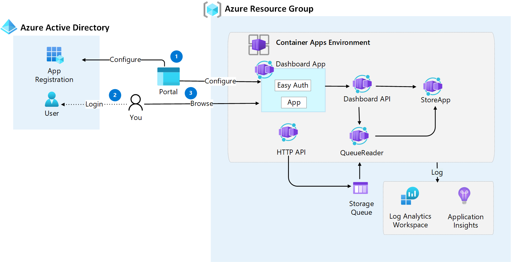

# Challenge 7: Enable Container App authentication
Azure Container Apps provides built-in authentication and authorization features (sometimes referred to as "Easy Auth"), to secure your external ingress-enabled container app with minimal or no code.

Up until now we have allowed anonymous access to the application. Let's protect the Dashboard App web application with Azure AD authentication using the Easy Auth service built into Container Apps.

The following image illustrates the steps in this challenge

## Main objectives
- Enable Azure AD Authentication on Container App
- Log in to Container App

## Activities
- Configure Azure AD identity provider for _Dashboard App_
- Verify authentication by accessing _Dashboard App_ with browser.

## Definition of done
- Configured Azure AD authentication for _Dashboard App_ Container App
- Browse _Dashboard App_ () and verify you are prompted for login
- Performed a successful login to view _Dashboard App_ (https://dashboardapp.[your container app environment domain]) 

 

## Helpful links
- [Authentication and authorization in Azure Container Apps (learn.microsoft.com)](https://docs.microsoft.com/en-us/azure/container-apps/authentication)
- [Enable authentication and authorization in Azure Container Apps with Azure Active Directory (learn.microsoft.com)](https://learn.microsoft.com/en-us/azure/container-apps/authentication-azure-active-directory)

## Solution
- View the solution here: [Challenge 6 - Solution](solution7.md)

## The challenges
- [Challenge 1: Setup the environment](challenge1.md)
- [Challenge 2: Deploy and troubleshoot a Container Apps environment](challenge2.md)
- [Challenge 3: Perform blue-green deployment with Container App traffic splitting](challenge3.md)
- [Challenge 4: Scale Container Apps](challenge4.md)

