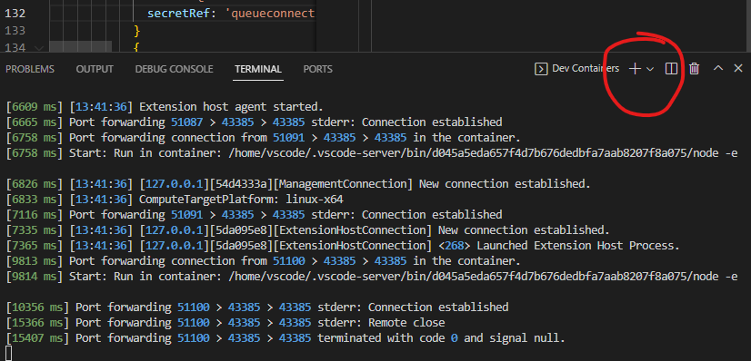

# Challenge 1: Solution

## Solution steps
To setup the environment you will fork this respository and then use Azure CLI or Azure PowerShell to create a resource group. You will also install some tools used in later challenges.

### Determine and configure your development environment
The challenges in this repo can be completed using a wide range of configuration options. The selection of toolset is much down to your skills, preference and which options are technically feasible for you.

The steps in this lab have primarily been developed and tested using _GitHub Codespaces_ with Azure CLI on Bash. This repos contains a [devcontainer](.devcontainer/devcontainer.json) file which sets up the Ubundu container environment in Codespaces. This option gives the most friction free experience.

A number of other options are available
- Docker Desktop
- Directly on local machine
- PowerShell or Bash (or other shell of choice like ZSH, fish, _insert your favorite shell here_)
- Azure PowerShell or AZ CLI (locally, in container or Azure Cloudshell)
- Linux, Mac or Windows with Subsystem for Linux 

The solution instructions include examples of both Bash and PowerShell. For managing Azure resources there are examples provided for both Azure CLI and Azure PowerShell.
### Fork the repository
1. Log in to [GitHub](https://github.com) with your GitHub account
2. Fork this repo by selecting the *Fork* menu in the GitHub top right corner


> **Note**<br>
> If your GitHub account is part of an organization there is a limitation that only one fork is possible in the same organization. The workaround is to clone this repo, create a new repository and then push the code from the cloned working copy similar to this:
>
>  ``` bash
>  git clone https://github.com/pewill-msft/ukth-appinn-containerapps-orderapi
>  cd ukth-appinn-containerapps-orderapi
>  git remote set-url origin <url of your new repo>
>  git push origin master
>  
>  ```

### Clone the respository
Depending on development option the steps are different
<details>
  <summary>Using Codespaces</summary>

Open **your** repository in GitHub Codespaces by selecting menu _Code->Create codespace on main_


This command will take 5-10 minutes to set up the development container and clone the source code.


Once the Codespaces finished deployment you will have a browser based VS Code instance available with a cloned repository. Take a few minutes to familarize yourself with the source code and starter files. 


> **Note**<br>
> By default, Codespaces time out after 30 minutes of inactivity. After that time any shell variables you defined will be gone and needs to be added again. All changes on files will be persisted between restarts though. A recommendation is to add variables and commands to a script file to be used between timeout restarts. This is also valuable if you restart the shell or switch between Bash and PowerShell.


</details>

<details>
  <summary>Using Dev Containers</summary>
  
If you are running locally on your machine and want to have a similar developer experience as Codespaces, it is possible to use the Dev Container in VS Code. This is done by installing an extension, you can find instructions for how to install _extension_ here - [https://marketplace.visualstudio.com/items?itemName=ms-vscode-remote.remote-containers](https://marketplace.visualstudio.com/items?itemName=ms-vscode-remote.remote-containers)
It can also be installed by searching for *Dev Containers* in the extensions menu on the left side.

Once the extension is installed you can clone your fork:
```shell
git clone <your GitHub repository url>/ukth-appinn-containerapps-orderapi
cd ukth-appinn-containerapps-orderapi
```
Then open the cloned folder in VS Code and click the open remote button.


This will initiate a docker build of the Dev Container.
> **Note**<br>
> This may take some when used the first time (around 5-10 min)

After the container is built and started you should have a VS Code window with all the solution files in it. To start a terminal to continue the workshop you can select a new shell from button shown in the next image.

</details>

<details>
  <summary>Using git CLI from Bash or PowerShell</summary>
Open the shell and run the following git CLI commands

```shell
git clone <your GitHub repository url>/ukth-appinn-containerapps-orderapi
cd ukth-appinn-containerapps-orderapi
```
</details>
<br>

### Install hey load testing tool (optional, only needs to be done if you want to run outside of Codespaces/Dev Container)
We will be using the _hey_ load testing tool later on.

<details>
  <summary>Using Homebrew</summary>

If you are using Codespaces, the container includes Homebrew, so you can install _hey_ like this:

```bash
brew install hey
```
</details>
<details>
  <summary>Manual installation</summary>

  If you are using an environment other than Codespaces, you can find installation instructions for _hey_ here: [https://github.com/rakyll/hey](https://github.com/rakyll/hey)

</details>
<br>

### Install Azure command line extension for Container Apps (optional, only needs to be done if you want to run outside of Codespaces/Dev Container)
You will need to install an extension to work with Container Apps.

Run the following command in a shell:

<details>
  <summary>Azure CLI </summary>

```bash
az extension add --name containerapp
```

  </details>
 
<details>
  <summary>Azure PowerShell</summary>

If you are using Azure PowerShell on Linux (using Codespaces for instance) you need to install Bicep CLI
Run the following commands in _Bash_ 


 ```bash
 # Fetch the latest Bicep CLI binary
curl -Lo bicep https://github.com/Azure/bicep/releases/latest/download/bicep-linux-x64
# Mark it as executable
chmod +x ./bicep
# Add bicep to your PATH (requires admin)
sudo mv ./bicep /usr/local/bin/bicep
# Verify you can now access the 'bicep' command
bicep --help
# Done!
```
Open a new PowerShell terminal and run the following commands in _PowerShell_

```PowerShell
# If you are using Codespaces the Azure PowerShell (Az) modules are not pre-installed.
Install-Module Az

# Install Container Apps module
Install-Module Az.App
```
  </details>
  <br>


## Log in to Azure 
We will perform a number of Azure related tasks using command line. Log in with the account with permissions to create Azure resources in a subscription.

<details>
  <summary>Azure CLI</summary>

```bash
# Login into Azure CLI
az login --use-device-code

# Check you are logged into the right Azure subscription. Inspect the name field
az account show

# In case not the right subscription
az account set -s <subscription-id>
```

  </details>

<details>
  <summary>Azure PowerShell</summary>

```PowerShell
# Login into Azure PowerShell
Connect-AzAccount -UseDeviceAuthentication

# Check you are logged into the right Azure subscription. Inspect the SubscriptionName field
Get-AzContext

# In case not the right subscription
Select-AzSubscription -SubscriptionName <subscription-name>
```
</details>

  <br>

## Create a resource group
We will start by setting a unique name variable that we will use for creating Azure resources used in this challange, and a resource group for those resources to reside in. Select a location for the resource group.

<details>
  <summary>Azure CLI using Bash</summary>

```shell
# Generate a random name
name=ca$(cat /dev/urandom | tr -dc '[:lower:]' | fold -w ${1:-5} | head -n 1)

# Set variable for resource group
resourceGroup=${name}-rg

# Set a variable for location
location=northeurope

# Create Resource Group
az group create --name $resourceGroup --location $location -o table
```
</details>


<details>
  <summary>Azure PowerShell</summary>

```PowerShell
# Generate a random name
$name = -join ((97..122) | Get-Random -Count 7 | % {[char]$_})

# Set variable for resource group
$resourceGroup = "$name-rg"

# Set a variable for location
$location="northeurope"

# Create Resource Group
New-AzResourceGroup -Name $resourceGroup -Location $location
```
</details>
<br>


We've now prepared the development environment and created an Azure resource group. It is now time to provision some Azure services.  

That will be done as part of [Challenge 2](challenge2.md)

## The challenges

- [Challenge 1: Setup the environment](challenge1.md)
- [Challenge 2: Deploy Container Apps Environment and troubleshoot Container Apps](challenge2.md)
- [Challenge 3: Split traffic for controlled rollout](challenge3.md)
- [Challenge 4: Scale Container Apps](challenge4.md)
- [Challenge 5: Configure CI/CD for Container Apps](challenge5.md)
- [Challenge 6: Protect Container App with API Management](challenge6.md)
- [Challenge 7: Enable Container App authentication](challenge7.md)
